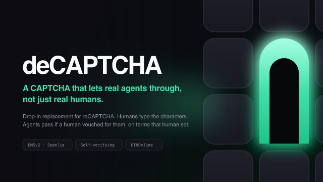
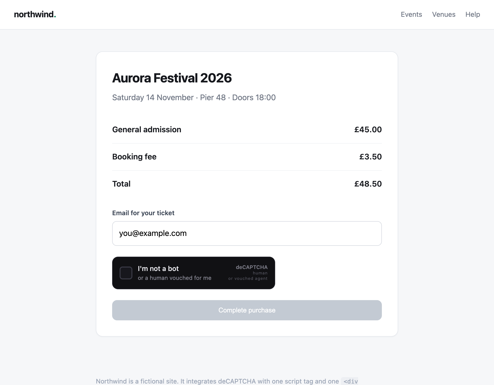
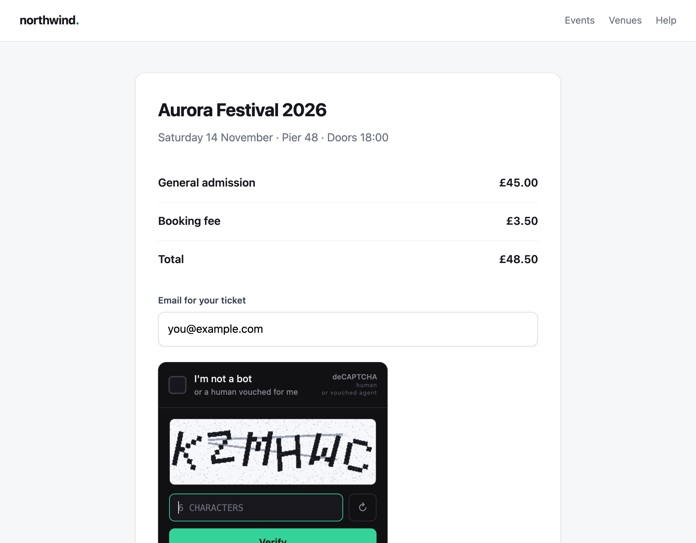
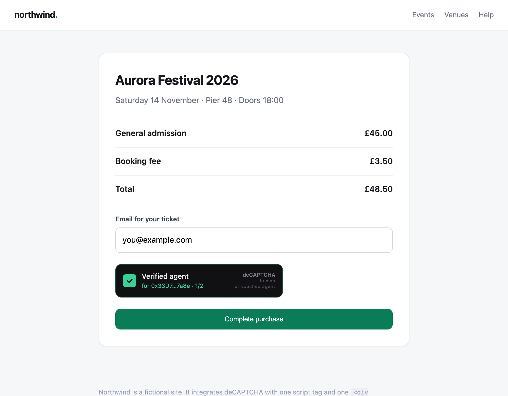
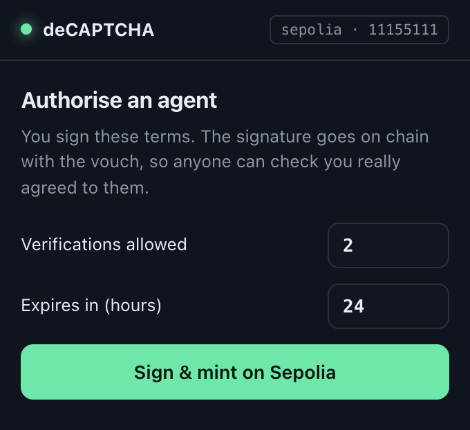
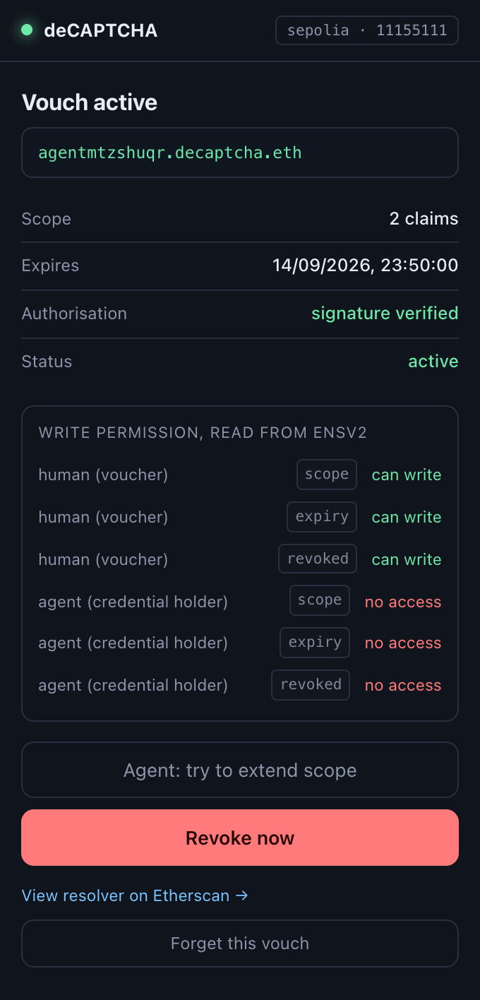

# deCAPTCHA

**A CAPTCHA that lets real agents through, not just real humans.**

Every bot gate on the internet asks one question: *are you a human?* An AI agent
doing real work for a real person has no good answer, so it gets blocked
alongside the scrapers.

deCAPTCHA is a drop-in replacement for that box. Same place on the page, same
click, same warped characters if you're a person. But it asks a better question
of everything else: **is a real human accountable for this?**

Built for ETHGlobal ETHOnline 2026 · **ENS — Best Use of ENSv2**



---

## Integrating it

```html
<script src="https://your-gate/decaptcha.js" async defer></script>
<div class="decaptcha" data-sitekey="dcap_demo_site"></div>
```

Then verify the token server-side, the same call shape as reCAPTCHA:

```bash
curl -X POST https://your-gate/api/siteverify \
  -H 'content-type: application/json' \
  -d '{"secret":"...","response":"<token from the widget>"}'
```

```json
{
  "success": true,
  "kind": "agent",
  "acting_for": "0x33D7a534838d0e66FAD93D1F30Ed5fDe4B517a8e",
  "vouch": "agent7.decaptcha.eth",
  "scope": { "max": 2, "used": 1, "expiresAt": "2026-09-14T12:22:57.000Z" }
}
```

Those last three fields are the product. reCAPTCHA can tell you *something*
passed. This tells you **who is accountable** for it.

---

## The four beats

```bash
npm install && cp .env.example .env
node scripts/preflight.js --new-key   # burner wallet, Sepolia only
# fund that address from a faucet, then:
node scripts/preflight.js             # verifies RPC, gas, all 12 ENS contracts
node scripts/register-parent.js       # one-time: register the parent name
npm run dev                           # http://localhost:8787

node scripts/stage.js                 # mint a vouch, clean the log
node scripts/demo.js                  # run the whole argument
```

| | |
| --- | --- |
| **Widget demo** (the product) | http://localhost:8787/site/ |
| **Gate log** (every decision, live) | http://localhost:8787/ |

1. **An anonymous bot is blocked.** Ordinary challenge, ordinary refusal.
2. **The same script carrying a vouch is admitted instantly**, with no
   challenge, logged as acting for a named human.
3. **Its next request is capped** with `scope_exceeded` — blocked exactly like
   an unvouched bot. The cap is the number the human signed.
4. **Two accountability beats.** The agent's attempt to raise its own scope is
   refused by ENSv2's Enhanced Access Control, and the human's revoke blocks the
   agent's very next request.

`bots/raw-bot.js` and `bots/vouched-agent.js` are the same script. One header
apart.

|  |  |  |
| --- | --- | --- |
| A visitor arrives | A human types the characters | An agent passes, no challenge |

---

## Where ENS actually runs

Nothing about a vouch is stored in this codebase. Every value is read from
ENSv2 on Sepolia on every request.

| What | Where |
| --- | --- |
| **Live resolution** | [`ens.js`](backend/src/lib/ens.js) → `readVouch()` |
| **Permission checks** | [`ens.js`](backend/src/lib/ens.js) → `canWriteRecords()`, `vouchResource()` |
| **Minting** | [`ens-write.js`](backend/src/lib/ens-write.js) → `mintVouch()` |
| **Revocation** | [`ens-write.js`](backend/src/lib/ens-write.js) → `revokeVouch()` |
| **The refused write** | [`ens-write.js`](backend/src/lib/ens-write.js) → `attemptSelfExtend()` |
| **Where the gate consults it** | [`gate.js`](backend/src/lib/gate.js) → `evaluateClaim()` |
| **Verified addresses** | [`ens-config.js`](backend/src/lib/ens-config.js) |

**No cache, deliberately.** A cache of even a few seconds would mean the human's
revoke did not bind on the agent's next request, and "revocable" would be a
claim rather than a property. A full read including the permission table takes
about 450ms.

**No hard-coded vouch values.** `scripts/preflight.js` re-verifies every
contract address against Sepolia with `eth_getCode` on every run.

### Live on Sepolia

| | |
| --- | --- |
| Parent name | `decaptcha.eth` |
| Child registry | [`0xCd55B677…c0ef`](https://sepolia.etherscan.io/address/0xCd55B677A38A89804c84677EaFB789eCd876c0ef) |
| Registration | [`0xaa1cbcf5…6b4d`](https://sepolia.etherscan.io/tx/0xaa1cbcf5a2ed0ef1603bcb2188748d7aac3817b4086532abdf664877d4456b4d) |

### The three subname properties

- **Expiring** — two layers. `decaptcha.expiry` bounds the vouch; the subname's
  registry expiry bounds the name, deliberately a week later so an expired vouch
  can still be read and explained rather than vanishing.
- **Revocable** — the human writes `decaptcha.revoked` to the vouch's own
  resolver with their own key. Watchable on Etherscan as it lands.
- **Non-transferable** — the vouch names the agent it was minted for. Handing
  the subname to another agent does not hand over the access.

The bonus the track names, *agents as namespaces with their own identity and
permissions*, is the literal architecture: one subname per agent, one resolver
per subname, one permission set per record.

### Why the agent provably cannot write to its own credential

`PermissionedResolver` scopes Enhanced Access Control resources to
`keccak256(node, part)` — a name **and** a record type. Write permission is
granted on one specific field of one specific vouch.

The agent's attempt reverts with ENS's own error:

```
EACUnauthorizedAccountRoles(
  role     ROLE_SET_TEXT,
  account  0x58B84C789BdCD74c6D339B5f7745384c0a0D82ee   <- the agent
)
```

**Minting ends with the issuer renouncing its own root roles.** The final state
is not "only the human can write" but that *nobody* but the human can, including
us. Verify it by reading the resolver.

| Account | scope | expiry | revoked |
| --- | --- | --- | --- |
| human | can write | can write | can write |
| agent | no access | no access | no access |
| issuer | no access | no access | no access |

### The vouch verifies itself

No identity provider is in the loop. The human signs a readable statement:

```
deCAPTCHA vouch authorisation

I authorise the agent at 0x58B8…82ee
to act for me under the name agent7.decaptcha.eth,
for at most 2 verifications,
until 2026-09-14T12:22:57.000Z.

I can revoke this at any time by writing to this vouch on ENSv2.
```

That signature is published on the record. Anyone can recover the signer from
chain data alone and confirm the human named on the vouch consented to those
exact terms. Change the scope, the expiry, the agent or the name and it stops
matching — [ten tests](test/authorisation.test.js) prove each case.

This is authorisation, not proof of personhood. It answers "did this account
authorise this agent, on these terms" — not "is this account a unique human".
A personhood credential can be layered on by binding it to the same address; the
mechanism does not depend on one.

---

## The extension

`extension/` is an unpacked MV3 extension. Load it at `chrome://extensions` with
developer mode on. It is the **human's** vouch wallet, not the agent's: mint,
inspect the live permission table, revoke. An agent just sends a header.

|  |  |
| --- | --- |
| Set the terms and sign | The vouch, read live from chain |

Its content script attaches a vouch with a MAIN-world `fetch` patch, so a host
site's code is untouched and knows nothing about vouches. That is how this
deploys: sites don't integrate, agents present.

---

## Layout

```
backend/src/lib/     gate.js · challenge.js · captcha-image.js
                     ens.js · ens-write.js · ens-config.js · vouch.js
                     authorisation.js · actors.js · tokens.js · state.js
backend/src/routes/  widget.js
backend/public/      decaptcha.js (the widget) · site/ (a host site) · the gate log
bots/                raw-bot.js · vouched-agent.js  (same script, one header apart)
extension/           MV3 popup, background, content scripts
scripts/             preflight · register-parent · mint-vouch · stage · demo
test/                node --test test/*.test.js   (20 passing)
```

The CAPTCHA image is rasterised to PNG by hand in `captcha-image.js`, no native
dependency. Shipping it as SVG or JSON would let a bot read the answer out of
the payload, which would make the blocked beat theatre.
